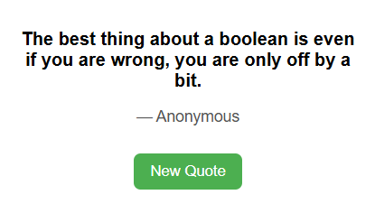

# QuickQuote – Motivational Quotes & Coding Tips Extension

**QuickQuote** is a lightweight browser extension that displays motivational quotes, coding tips, and witty developer humor. Each time you click a button, a new quote appears, keeping your browser popup fresh and inspiring.



---

## Features

* Displays random motivational quotes and coding tips.
* Simple, clean, and responsive popup interface.
* Lightweight and fast with a loading spinner while fetching quotes.
* Works offline once quotes are loaded.

---

## Installation

### Chrome / Edge

1. Download or clone this repository to your computer.
2. Open your browser and go to **Extensions**:

   * **Chrome:** `chrome://extensions/`
   * **Edge:** `edge://extensions/`
3. Enable **Developer Mode** (top-right toggle).
4. Click **Load unpacked** and select the folder where you saved QuickQuote.
5. The extension icon will appear in the toolbar. Click it to open the popup.

### Firefox

1. Open Firefox and go to `about:debugging`.
2. Click **This Firefox** → **Load Temporary Add-on**.
3. Select the `manifest.json` file from the QuickQuote folder.
4. The extension icon will appear in the toolbar. Click it to open the popup.

---

## Usage

1. Click the QuickQuote extension icon in your browser toolbar.
2. A random quote will be displayed along with the author.
3. Click the **New Quote** button to fetch another random quote.
4. If the quotes fail to load, a message will appear in the popup.

---

## File Structure

```
QuickQuote/
│
├─ popup.html       # Popup interface
├─ popup.js         # Logic for fetching and displaying quotes
├─ style.css        # Styling for popup
├─ popup.css        # Additional styling for loader and buttons
├─ manifest.json    # Chrome/Edge/Firefox extension configuration
├─ quotes.json      # List of motivational quotes
└─ icons/           # Extension icons (16px, 48px, 128px)
```

---

## Screenshots / Visual Tutorial

### 1. Chrome / Edge

1. Go to Extensions page (`chrome://extensions/` or `edge://extensions/`)
2. Enable **Developer Mode**
3. Click **Load unpacked** and select the folder
4. Click the QuickQuote icon in the toolbar to see quotes

### 2. Firefox

1. Go to `about:debugging` → This Firefox
2. Click **Load Temporary Add-on** and select `manifest.json`
3. Click the extension icon to view quotes

---

## Customization

* **Quotes:** Add, remove, or edit quotes in `quotes.json`.
* **Styling:** Modify colors, fonts, and layout in `style.css` and `popup.css`.
* **Icons:** Replace icons in the `icons/` folder with your own images.

---

## Contributing

Contributions are welcome! Feel free to:

* Add new quotes.
* Improve the UI/UX.
* Add more features like daily notifications.

---

## License

This project is licensed under the MIT License.
